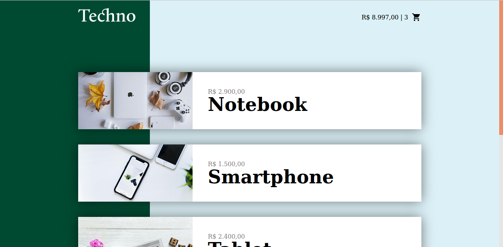
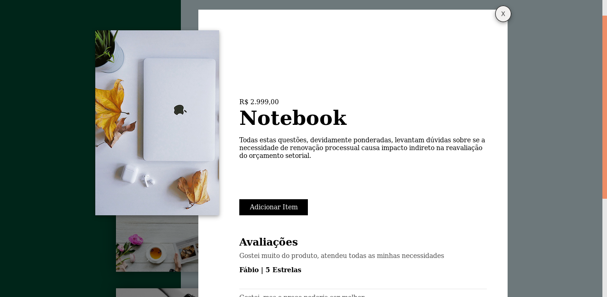
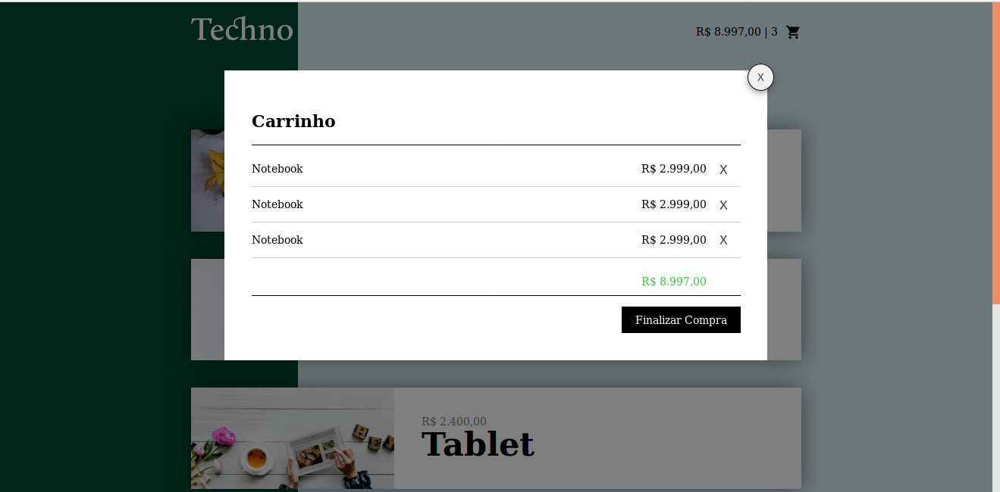

# Projeto Techno

## Aplicação simples em Vuejs

### Descrição
Aplicação em Vuejs que simula a compra de produtos. Os dados são obtidos via arquivo json e as alterações realizadas ficam armazenadas em LocalStorage. Por ser uma aplicação simples do Vuejs, não possui interação com banco de dados.

#### Tela Inicial com a listagem de Produtos disponíveis
Apresenta detalhes dos produtos mantidos no arquivo produtos.json

#### Detalhes sobre o produto selecionado
Busca o arquivo json com os dados do produto e os mostra.

#### Listagem de itens no carrinho
Realiza a inclusão e exclusão do produto, alterando diretamente o estoque armazenado em LocalStorage.

